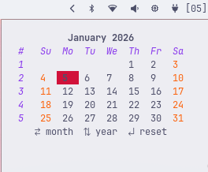

# Zen-Cal

A minimal, interactive terminal-based calendar built in **Go**, with month and year navigation using vim-style or arrow keys. Features an upcoming events display with full event management capabilities!

<div style="display: flex; gap: 12px;">
  
</div>

> Note : use [https://github.com/beaterblank/omarchy-theme-sync-ctl](https://github.com/beaterblank/omarchy-theme-sync-ctl) for dynamic theme change in omarchy.

## Installation
> **Note:** The installer updates your Waybar configuration directly but first creates a backup to restore on uninstall, make sure to keep a copy of your config in case recovery is needed.

### NixOS / Nix Flakes (Recommended for Nix users)

**Try it without installing:**
```bash
nix run github:beaterblank/zen-cal
```

**Install to profile:**
```bash
nix profile install github:beaterblank/zen-cal
```

**Add to your flake.nix:**
```nix
{
  inputs.zen-cal.url = "github:beaterblank/zen-cal";
  
  # Then in your outputs, add to packages:
  # zen-cal.packages.${system}.default
}
```

**Home Manager module:**
```nix
{
  imports = [ zen-cal.homeManagerModules.default ];
  
  programs.zen-cal = {
    enable = true;
    settings = {
      today = "#f38ba8";
      text = "#cdd6f4";
      max_events = "5";
    };
    calendars = {
      personal = "#f38ba8";
      work = "#89b4fa";
      family = "#a6e3a1";
    };
    default_calendar = "personal";
    showLegend = true;
    showHolidays = false;
    showWeekNumbers = true;
    events = [
      { date = "2025-01-15"; title = "Team Meeting"; description = "Weekly sync"; calendar = "work"; }
      { date = "2025-02-14"; title = "Valentine's Day"; calendar = "family"; }
    ];
  };
}
```

**NixOS module (system-wide):**
```nix
{
  imports = [ zen-cal.nixosModules.default ];
  
  programs.zen-cal.enable = true;
}
```

### Traditional Installation

#### Setup
```bash
git clone https://github.com/beaterblank/zen-cal.git && cd zen-cal
```
Install `jq` if not already
```bash
sudo pacman -S jq
```
#### Building
optionally build if you'd like to :
* `Go` is required to build
```bash
chmod +x ./build.sh
./build.sh
```
#### Installation
gets the latest release if not built.
```bash
chmod +x ./install.sh
./install.sh
```

## Controls

### Normal Mode (Calendar Navigation)

| Key                  | Action              |
| -------------------- | ------------------- |
| `←`, `h`             | Previous day        |
| `→`, `l`             | Next day            |
| `↑`, `k`             | Previous week       |
| `↓`, `j`             | Next week           |
| `Shift+←`            | Previous month      |
| `Shift+→`            | Next month          |
| `Shift+↑`            | Previous year       |
| `Shift+↓`            | Next year           |
| `r`                  | Reset to today      |
| `Enter`              | Enter event list    |
| `q`, `Ctrl+C`, `esc` | Quit                |

### Event List Mode

| Key       | Action              |
| --------- | ------------------- |
| `↑`, `k`  | Previous event      |
| `↓`, `j`  | Next event          |
| `←`, `h`  | Back to calendar    |
| `→`, `l`  | Edit selected event |
| `a`       | Add new event       |
| `Enter`   | Edit selected event |
| `d`       | Delete selected event |
| `m`       | Move event to new day |
| `/`       | Search events       |
| `esc`, `q`| Back to calendar    |

### Search Mode

Search works in two stages: typing mode, then navigation mode.

#### Typing Mode (default)

| Key         | Action                        |
| ----------- | ----------------------------- |
| Type        | Enter search query            |
| `Enter`     | Switch to navigation mode     |
| `Backspace` | Delete character              |
| `esc`       | Cancel search                 |

#### Navigation Mode (after pressing Enter)

| Key       | Action              |
| --------- | ------------------- |
| `↑`, `k`  | Previous result     |
| `↓`, `j`  | Next result         |
| `→`, `l`  | Go to selected event |
| `←`, `h`  | Exit search         |
| `Enter`   | Go to selected event |
| `esc`, `q`| Exit search         |

### Popup Dialogs (Add/Edit)

| Key         | Action              |
| ----------- | ------------------- |
| `Tab`, `↓`  | Next field          |
| `Shift+Tab`, `↑` | Previous field |
| `Space`, `←`, `→` | Toggle (All-day/Status) |
| `Enter`     | Confirm (on button) |
| `esc`       | Cancel              |

### Delete Confirmation

| Key       | Action              |
| --------- | ------------------- |
| `y`       | Quick confirm delete |
| `n`, `esc`| Cancel              |
| `Tab`, `←`, `→` | Toggle buttons |
| `Enter`   | Confirm selection   |

### Move Event Mode

| Key                  | Action              |
| -------------------- | ------------------- |
| `←`, `h`             | Previous day        |
| `→`, `l`             | Next day            |
| `↑`, `k`             | Previous week       |
| `↓`, `j`             | Next week           |
| `Shift+←`            | Previous month      |
| `Shift+→`            | Next month          |
| `Shift+↑`            | Previous year       |
| `Shift+↓`            | Next year           |
| `Enter`              | Confirm move        |
| `esc`, `q`           | Cancel move         |

All keybinds are configurable (see Configuration section below).

## Uninstallation

```bash
chmod +x ./uninstall.sh ./purge.sh
./uninstall.sh
# optionally only remove zen config files using purge.sh (if your waybar config backup is lost)
```

## Configuration

Zen-Cal can be customized to match your theme. The following defaults work well with most dark themes:

```toml
# Colors
today      = #f38ba8
today_text = #cdd6f4
headings   = #cba6f7
text       = #cdd6f4
weekends   = #f9e2af

# Display options
max_events           = 5
show_legend          = true
show_holidays        = true
show_week_numbers    = true
event_indicator_days = 0    # Days before event to show Waybar indicator (0 = day of only)

# Default calendar for new events (use folder name, not display name)
default_calendar = personal

# Keybinds (comma-separated for multiple keys)
key_left       = left, h
key_right      = right, l
key_up         = up, k
key_down       = down, j
key_prev_month = shift+left
key_next_month = shift+right
key_prev_year  = shift+up
key_next_year  = shift+down
key_reset      = r
key_quit       = ctrl+c, q, esc

# Calendars (calendar.<name> = #color | Display Name)
calendar.personal = #f38ba8 | Personal
calendar.work     = #89b4fa | Work
calendar.family   = #a6e3a1 | Family
```

You can adjust these values to match your preferred color scheme and keybinds in `~/.config/zen-cal/zen-cal.conf`.

### Configurable Keybinds

You can customize the navigation keys by adding keybind settings to your config file. Each keybind accepts a comma-separated list of keys:

| Setting          | Default Keys        | Description      |
| ---------------- | ------------------- | ---------------- |
| `key_left`       | `left, h`           | Previous day     |
| `key_right`      | `right, l`          | Next day         |
| `key_up`         | `up, k`             | Previous week    |
| `key_down`       | `down, j`           | Next week        |
| `key_prev_month` | `shift+left`        | Previous month   |
| `key_next_month` | `shift+right`       | Next month       |
| `key_prev_year`  | `shift+up`          | Previous year    |
| `key_next_year`  | `shift+down`        | Next year        |
| `key_reset`      | `r`                 | Reset to today   |
| `key_quit`       | `ctrl+c, q, esc`    | Quit application |

### Display Options

| Setting               | Default  | Description                                      |
| --------------------- | -------- | ------------------------------------------------ |
| `max_events`          | `5`      | Number of upcoming events to display             |
| `show_legend`         | `true`   | Show calendar color legend below the calendar    |
| `show_holidays`       | `false`  | Display US federal holidays                      |
| `show_week_numbers`   | `true`   | Show ISO week numbers in leftmost column         |
| `default_calendar`    | (empty)  | Default calendar for new events (folder name)    |
| `event_indicator_days`| `0`      | Days before an event to show the Waybar indicator (0 = day of only) |

### Calendars

Zen-Cal supports multiple calendars, each with its own color. Days with events are highlighted in the calendar using the event's calendar color.

#### Vdirsyncer Integration (Auto-detection)

Zen-Cal automatically detects calendars from [vdirsyncer](https://vdirsyncer.pimutils.org/). It searches for calendars in:

1. Paths defined in `~/.config/vdirsyncer/config`
2. `~/.local/share/vdirsyncer/`
3. `~/.calendars/`
4. `~/.local/share/calendars/`

For each detected calendar, Zen-Cal reads:
- **displayname** file for the human-readable name
- **color** file for the calendar color
- All `.ics` files for events

Events from vdirsyncer calendars are loaded automatically, including:
- Event title (SUMMARY)
- Date and time (DTSTART)
- Description (DESCRIPTION)
- Free/Busy status (TRANSP: TRANSPARENT=Free, OPAQUE=Busy)

#### Automatic Synchronization

When you add, edit, or delete events, Zen-Cal automatically runs `vdirsyncer sync` in the background to push changes to your CalDAV server. This happens:
- **After saving changes**: Sync runs asynchronously so the UI stays responsive
- **On exit**: If syncs are still pending, Zen-Cal waits for them to complete before closing

This means you don't need to manually run `vdirsyncer sync` after making changes in Zen-Cal.

#### Overriding Vdirsyncer Colors

You can override colors for auto-detected calendars in your zen-cal config:

```toml
# Override color for a vdirsyncer calendar named "work"
calendar.work = #89b4fa | Work

# Override color for a calendar named "personal" 
calendar.personal = #f38ba8 | Personal
```

#### Manual Calendar Configuration

If no vdirsyncer calendars are detected, Zen-Cal falls back to manually configured calendars.

Define calendars in your config file using the format `calendar.<name> = #color | Display Name`:

```toml
calendar.personal = #f38ba8 | Personal
calendar.work     = #89b4fa | Work
calendar.family   = #a6e3a1 | Family
```

The display name is optional. If omitted, the code name will be used in the legend.

#### Default Calendar for New Events

You can set which calendar is pre-selected when adding new events:

```toml
default_calendar = personal
```

The value should be the calendar's folder name (e.g., `home`, `work`, `personal`), not the display name. If not set or the specified calendar doesn't exist, the first calendar alphabetically is used.

#### Default Calendars

If no calendars are configured or detected, three defaults are provided: `personal` (pink), `work` (blue), and `family` (green).

#### Local Events

In addition to vdirsyncer events, you can still add local events via `~/.config/zen-cal/events.conf`. Local events are merged with vdirsyncer events.

### Week Numbers

The calendar displays ISO week numbers in the leftmost column by default. You can hide them with:

```toml
show_week_numbers = false
```

### Color Legend

The calendar displays a color legend showing which color corresponds to which calendar. You can toggle this with:

```toml
show_legend = true   # or false to hide
```

The legend shows: `● today  ● selected  ● Personal  ● Work  ● Family  ● Holidays`

### US Holidays

Zen-Cal can optionally display US federal holidays on your calendar. Enable this feature in your config:

```toml
show_holidays = true
```

When enabled, the following holidays are automatically displayed:
- New Year's Day (January 1)
- Martin Luther King Jr. Day (3rd Monday of January)
- Presidents' Day (3rd Monday of February)
- Memorial Day (Last Monday of May)
- Juneteenth (June 19)
- Independence Day (July 4)
- Labor Day (1st Monday of September)
- Columbus Day (2nd Monday of October)
- Veterans Day (November 11)
- Thanksgiving Day (4th Thursday of November)
- Christmas Day (December 25)

Holidays are displayed with a 🎉 emoji and use the `holidays` calendar color (yellow by default). You can customize the holiday color:

```toml
calendar.holidays = #f9e2af | Holidays
```

> **Note:** Holidays are read-only and cannot be edited, moved, or deleted.

### Events

Zen-Cal loads events from two sources:

1. **Vdirsyncer calendars** - Automatically loaded from `.ics` files (read-only in zen-cal)
2. **Local events file** - `~/.config/zen-cal/events.conf` (can be added/edited/deleted/moved)

Zen-Cal displays upcoming events to the right of the calendar. Events are loaded from `~/.config/zen-cal/events.conf` and can be managed directly from the application.

#### Managing Events

1. **Navigate** to a day using the day/month/year navigation keys
2. **Press Enter** to enter event list mode
3. Use **↑/↓** or **k/j** to select an event
4. Press **a** to add, **e** to edit, **d** to delete, or **m** to move

> **Note:** Events loaded from vdirsyncer are read-only in zen-cal. To edit them, use your calendar application or edit the `.ics` files directly.

#### Local Event File Format

Local events are stored in `~/.config/zen-cal/events.conf`. Each line represents an event:
```
YYYY-MM-DD | Time | Title | Description | Calendar | FreeBusy
```

| Field | Format | Description |
|-------|--------|-------------|
| Date | `YYYY-MM-DD` | Event date (required) |
| Time | `HH:MM` or `all-day` | Event time or "all-day" for full-day events |
| Title | text | Event name (required) |
| Description | text | Optional description |
| Calendar | text | Calendar name (defaults to first calendar) |
| FreeBusy | `busy` or `free` | Whether the event marks time as busy or free |

Example `events.conf`:
```
# Zen-Cal Events
# Format: YYYY-MM-DD | Time | Title | Description | Calendar | FreeBusy

2025-01-15 | 09:00 | Team Meeting | Weekly sync with the team | work | busy
2025-01-20 | 14:30 | Doctor Appointment | | personal | busy
2025-02-14 | all-day | Valentine's Day | Don't forget flowers! | family | free
2025-03-01 | 17:00 | Project Deadline | Submit final report | work | busy
2025-12-25 | all-day | Christmas | Holiday | family | free
```

- Lines starting with `#` are comments
- Time can be `HH:MM` (24-hour format) or `all-day`
- FreeBusy indicates whether the event blocks your time (`busy`) or not (`free`)
- If no calendar is specified, the first defined calendar is used
- Events are automatically sorted by date
- Only events on or after the selected date are shown
- The number of events displayed is controlled by `max_events` in the config
- Days with events are highlighted on the calendar in the event's calendar color

### Moving Events

To move an event to a different day:
1. Enter event list mode (press `Enter` on a day)
2. Select the event you want to move
3. Press `m` to enter move mode
4. Navigate to the new date using the calendar navigation keys
5. Press `Enter` to confirm the move, or `Esc` to cancel

The calendar title will show which event you're moving.

### Event Display

The upcoming events list shows:
- **Event name** with calendar indicator
- **Time** (or "All-day" for full-day events)
- **Status** (Busy in red, Free in green)
- **Description** (if present)

### Window Rules

`~/.config/hypr/app/zen-cal.conf` file defines the window rules; adjust them to position the calendar anywhere on the monitor.

It should look like this:

```
windowrulev2 = float, class:^(TUI.zencal)$
windowrulev2 = size 25% 22%, class:^(TUI.zencal)$
windowrulev2 = move 75% 2.5%, class:^(TUI.zencal)$
```

* `move` controls the window's position on the monitor.
* `size` controls the window's dimensions.

> **Note:** With the events panel, you may want a larger window size (e.g., `size 25% 22%` or more) to accommodate the event list and popups.

By default, the module appears in the right-most corner. If you want it centered, update your Waybar configuration aswell:

* Add `custom/zen-cal` to `modules-center`.
* Remove `custom/zen-cal` from the `modules-right`.

## Waybar Integration

Zen-Cal provides a `--waybar` flag that outputs JSON with both display text and a Pango markup tooltip for Waybar custom modules:

```bash
zen-cal --waybar
```

This outputs JSON like:
```json
{"text": " Sat 07 ", "tooltip": "<span>...</span>"}
```

### Waybar Configuration

Add a custom module to your Waybar config:

```json
{
    "custom/zen-cal": {
        "format": "{}",
        "exec": "zen-cal --waybar",
        "return-type": "json",
        "tooltip": true,
        "on-click": "zen-cal",
        "interval": 60
    }
}
```

Then add `"custom/zen-cal"` to your modules list (e.g., `modules-right`).

The module shows:
- Display text: ` Mon 01 ` (calendar icon + day of week + day number)
- Alt field: `has-events` if there are events today, `no-events` otherwise (for format-icons)
- Tooltip: Current month calendar with today highlighted, days with events underlined in their calendar color, and today's events with time, title, and free/busy status

### Format Icons

You can use the `alt` field to show different icons based on whether there are upcoming events.

By default, the icon changes only on the day of an event. You can configure how many days in advance the indicator changes using `event_indicator_days` in your config:

```toml
# Show "has-events" icon starting 1 day before events (0 = day of only)
event_indicator_days = 1
```

For example:
- `0` - indicator shows only on the day of the event (default)
- `1` - indicator shows the day before and day of
- `7` - indicator shows up to a week before

Waybar configuration example:

```json
{
    "custom/zen-cal": {
        "format": "{icon} {}",
        "format-icons": {
            "has-events": "󰃭",
            "no-events": "󰃮"
        },
        "exec": "zen-cal --waybar",
        "return-type": "json",
        "tooltip": true,
        "on-click": "zen-cal",
        "interval": 60
    }
}
```

### Tooltip-Only Mode

If you just need the Pango markup output (without JSON wrapping), use:

```bash
zen-cal --tooltip
```

## Dependencies

* hyprland
* Waybar
* go lang
* jq (installation dependency)
* vdirsyncer (optional, for calendar sync)
* `github.com/charmbracelet/bubbletea`
* `github.com/charmbracelet/lipgloss`
